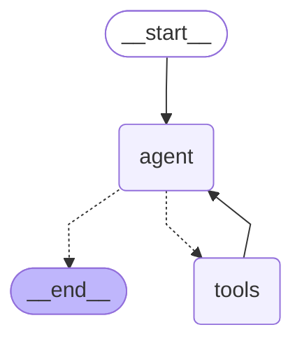

# Harness demo for Talk to my Docs, Talk to my Data — an agent for customer operations

A GenAI assistant for internal enterprise users that answers questions across two data
shapes — **policy documents** and **operational case data** — through one agent loop with
an explicit harness, built on LangGraph. Design spec in [`docs/SPEC.md`](docs/SPEC.md);
build process and lessons in [`docs/BUILD-NOTES.md`](docs/BUILD-NOTES.md).

## Problem statement

Customer-service team leads and analysts answer operational questions that span two
sources: what policy requires (wiki documents) and what is actually happening (case
data) — and the valuable questions, like *"what are our top complaint categories and what
do our guidelines require for them?"*, need both at once. Today a human joins those
sources by hand, or worse, answers from memory — misquoting policy and inventing numbers
in a domain where a wrong number is compliance exposure (retention periods, escalation
SLAs), not an inconvenience. This project delivers grounded, cited, refusal-capable
answers over both sources in seconds, through an agent whose harness makes that
trustworthiness enforceable rather than hoped for.

## Users

| Persona | Typical question | Shape |
|---|---|---|
| **Service team lead** | Top complaint categories, and what do our guidelines say about handling them? | Cross-source |
| **BA / ops analyst** | Average resolution time by channel? How many complaints in July? | Data |
| **New service agent** | What is the escalation process? How long are records retained? | Docs |

## Assumptions

- **Budget:** ~$0.01/question on gpt-4o-mini; ~$5/month at this usage. Committed embedding
  index so cold starts never pay for indexing.
- **Users:** <20, internal, trusted network — so the demo carries no auth (see Limitations).
- **Platform:** serverless (Vercel) + the OpenAI API standing in for a private inference
  endpoint; the model is injected in one place (`build_graph`) precisely so that
  assumption is swappable.
- **Data:** synthetic (3 fictional policies, 24 cases); English only.

## Limitations (known, deliberate)

24 rows and 3 documents — retrieval-quality claims don't transfer to a real corpus
without hybrid search and reranking. No authentication or per-user data scoping.
Client-held session memory is forgeable. No write actions exist by construction.
Single-tenant, single-language.

## Expected outcome & business value

**Outcomes — enforced, not aspirational** (each is an assertion in
[`scripts/eval.py`](scripts/eval.py), and the build history shows the eval catching real
violations):

- Every policy claim carries a document citation.
- **Zero invented numbers** — forbidden-match asserts prove the agent declines rather than
  fabricates (refund amount, CEO questions).
- Cross-source questions answered in a single conversational turn, seconds not minutes.
- Honest "I don't have that" when the data can't answer.

**Business value positioning:**

- **Time:** a team lead's weekly-review prep drops from dashboard-plus-wiki archaeology
  (minutes per question, context-switching between systems) to seconds per question in
  one interface.
- **Risk:** the expensive failure isn't a slow answer, it's a *confidently wrong* one
  quoted to a customer or an auditor. The harness converts that risk class into either a
  correct cited answer or an explicit refusal — and the eval regression-tests that
  guarantee on every change.
- **Capacity:** new agents self-serve policy answers instead of interrupting seniors;
  the same design scales from this demo to a governed corpus by swapping data
  connections, not architecture.
- **Auditability:** every answer traces to its tool calls (LangSmith), and every policy
  claim to a document — an answer an auditor can replay.

## Architecture overview

| Layer | What it is |
|---|---|
| **Frontend** | One static HTML page ([`web/index.html`](web/index.html)) whose only job is rendering the agent's event stream — steps, tool calls, recoveries — as they happen. The loop is *visible*. |
| **Backend** | A thin FastAPI route ([`main.py`](main.py)): parse → `run_events()` → stream NDJSON. All agent logic lives in [`graph_agent/`](graph_agent/). |
| **Data plane** | Committed embedding index over 3 markdown policies + in-memory 24-row CSV behind a typed query tool. |
| **Eval** | First-class component, not an afterthought: 16 keyless contract tests + an 8-case live eval asserting trajectories, numbers, citations, and non-hallucination. |

The agent itself, rendered by LangGraph from the compiled graph
(`build_graph().get_graph().draw_mermaid()` — this is generated, not hand-drawn):



Solid edges always fire; dotted edges are the model's decision each step: request tools
(→ `tools`, whose results loop back) or answer in text (→ end). Which source to consult —
docs, data, or both in sequence — is that same per-step decision, which is what lets one
loop handle single-source, cross-source, and multi-hop questions alike.

## The harness — 13 concerns, honestly scored

The harness is everything around the model that makes the loop safe to run. Status per
concern: ✅ built · 🟡 partial or deliberate non-build (with the argument) · ❌ gap.

| # | Concern | Status | Where / why |
|---|---|---|---|
| 1 | Max iteration | ✅ | `recursion_limit = 12` (6 model calls) in [`graph_agent/runner.py`](graph_agent/runner.py); a team lead won't wait past ~30s and each step costs money. Tested. |
| 2 | Termination | 🟡 | Three exits: text answer → END; ceiling → **forced no-tools summary** (honest partial answer, never a hang); hard failure → error event. Gap: token and wall-clock budgets are observed but not yet enforced. |
| 3 | Memory | 🟡 | Session memory = client posts transcript (stateless server, serverless-safe). Long-term/persona memory deliberately not built: the production move is a checkpointer (Postgres, keyed to an authenticated user), and in-memory checkpoints reset on cold starts. |
| 4 | Tool-call check | ✅ | Pydantic `args_schema` on every tool; invalid args become recoverable ToolMessages; the typed schema is an **allowlist** — destructive queries are unrepresentable, not blocklisted. A malformed month filter is a validation error, never a silent wrong "0". |
| 5 | Supervisor / LLM choice | 🟡 | No supervisor by design: routing is the model's per-step decision inside one loop (see graph). Model injected + env-configured (gpt-4o-mini, temperature 0); swap for a private endpoint without touching the graph. Multi-agent is the scale-up path, not the starting point. |
| 6 | Middleware | 🟡 | The model↔tool middleware *is* `ToolNode` + `runner.py` (validation, error shaping, event translation). HTTP middleware (auth, rate limits) is roadmap. |
| 7 | Checkpoint / state | 🟡 | Not wired, on purpose: `compile(checkpointer=…)` + `thread_id` is one line when there's an authenticated user to key it to. |
| 8 | Feedback in the loop | ❌ | Not built. Design: 👍/👎 attaches to the **LangSmith run id** (`create_feedback`) so feedback lands on the exact trace and feeds the eval set. |
| 9 | Regression test | ✅ | 16 keyless contract tests + the 8-case eval rerun on every change — it caught two real silent-wrong-answer bugs during the build ([`docs/BUILD-NOTES.md`](docs/BUILD-NOTES.md)). CI gate is the production step. |
| 10 | Latency & token | 🟡 | Observed everywhere (per-step usage in the event stream; per-call latency/tokens in traces); *enforced* only via the step ceiling. Observed vs enforced is the honest distinction. |
| 11 | Trajectory eval | 🟡 | The eval asserts trajectories deterministically: which tools ran, none missing, none unexpected, cross-source case must call both. Graded (LLM-judge) trajectory scoring is the next layer. |
| 12 | QA-pair eval | 🟡 | Accuracy: exact-number asserts. Faithfulness: forbidden-match asserts (can't invent refunds or CEOs) + required citations. Judge-based faithfulness/relevance scoring is roadmap — deterministic asserts first, because they can't lie. |
| 13 | Deterministic vs non-deterministic testing | ✅ | The test architecture *is* this split: deterministic loop contract → scripted fake model injected into `build_graph`, keyless; non-deterministic behavior → live eval with tolerant assertions (the refund question passes by either honest path). |

**What the framework provides vs. what the harness still owed:** the loop (`StateGraph` +
conditional edge), transcript state (`add_messages`), tool dispatch/validation
(`ToolNode`), errors-as-data (`handle_tool_errors`), step ceiling (`recursion_limit`), and
native LangSmith tracing come from LangGraph. Forced honest summaries had to be added on
top (`runner.py`); duplicate-call interception and token/time budget enforcement are not
provided and are documented gaps. Enumerating exactly where the framework's guarantees end
is part of using one responsibly.

## Demo questions (tagged by persona)

| Persona | Question | Demonstrates |
|---|---|---|
| New agent | What is the complaint escalation process? | Docs + citation |
| Compliance | How long are complaint records retained? | Docs + citation |
| BA | How many complaints did we get in July? | Data, exact |
| BA | What is the most common complaint category? | Data, exact |
| BA | Average resolution time by channel? | Data, grouped |
| **Team lead** | **Top complaint categories, and what do our guidelines say about handling them?** | **Cross-source — the centrepiece** |
| Anyone | What's our average refund amount? | Error → honest recovery, no invented number |
| Anyone | Who is the CEO? | Refusal |

## Setup

```bash
python -m venv .venv
.venv\Scripts\activate            # Windows (source .venv/bin/activate elsewhere)
pip install -r requirements.txt pytest
copy .env.example .env            # add your OPENAI_API_KEY

pytest -q                         # 16 unit tests, no key needed
uvicorn main:app --reload         # http://localhost:8000
python scripts/eval.py            # 8 scripted end-to-end cases (needs key)
python -m retrieval.build_index   # only after editing the documents
```

## Observability

Set `LANGSMITH_TRACING=true` + `LANGSMITH_API_KEY` and LangGraph traces natively — the
trace tree mirrors the graph (run → agent → tools → agent → final) with tokens and latency
per call. Unset, nothing traces and the app runs identically.

## Deploy (Vercel)

Push to GitHub → import in Vercel → set `OPENAI_API_KEY` (+ optional LangSmith vars) →
deploy. [`vercel.json`](vercel.json) pins the native FastAPI preset; `main.py` at the
repo root is the entrypoint and all routes are served by the ASGI app directly.

## Production roadmap (one breath each)

Auth + per-team case scoping — as prescribed by the corpus's own Data Privacy Policy
("agents see only the cases assigned to their team": the deployed system enforces the
policy the agent retrieves) · checkpointer-backed memory keyed to the user · 👍/👎 →
LangSmith feedback loop · eval in CI as a regression gate · hybrid search + reranking for
a real corpus · private model endpoint behind a gateway · human confirmation for any
future side-effecting tool · rate limiting.

